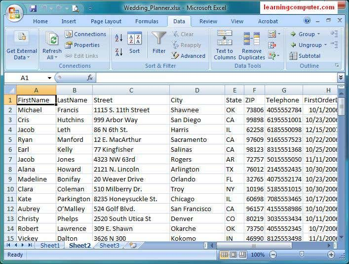

<html lang="en">
<head>
  <meta charset="UTF-8" />
  <meta name="viewport" content="width=device-width, initial-scale=1.0"/>
  <title>Harun's Personal Website</title>
  
<head>
<!-- Font Awesome CDN -->
<link rel="stylesheet" href="https://cdnjs.cloudflare.com/ajax/libs/font-awesome/6.5.0/css/all.min.css">
<!-- Link to External CSS -->
<link rel="stylesheet" href="style.css">
<link rel="stylesheet" href="https://cdnjs.cloudflare.com/ajax/libs/font-awesome/6.5.0/css/all.min.css">

<body onload="preloader()">
  <!-- Preloader -->
  

  <!-- Google Search -->
  

    <form action="https://www.google.com/search" method="GET" target="_blank">
      <input type="text" name="q" placeholder="Search Google..."><button type="submit">Search</button>
    </form>
  

   <!-- Three Dot Menu -->

  <button class="menu-button" onclick="toggleMenu()">
    <i class="fas fa-ellipsis-v"></i>
  </button>
  

    <a href="#hero">🏠 Home</a>
    <a href="#about">👤 Profile</a>
    <a href="#portfolio">🧩 Projects</a>
    <a href="#gallery">🖼️ Gallery</a>
    <a href="#portfolio">📁 Portfolio</a>
    <a href="#social">🌐 Social Media</a>
    <a href="#about">ℹ️ About</a>
    <a href="#settings">⚙️ Settings</a>
    <a href="#privacy">🔐 Privacy</a>
    <a href="#contact">📞 Contact</a>
    <a href="Md_Harun_Or_Rashid_CV_Image.pdf" download>⬇️ Download CV</a>
    <a href="#order">✉️ Send Message</a>
  

  <!-- Hero Section -->
  <section id="hero">
    <h1>Hello, I'm </h1>
    
Welcome to my official site.

    <a href="#portfolio" class="btn">View Portfolio</a>
    <a href="Md_Harun_Or_Rashid_CV_Image.pdf" download class="btn">Download CV</a>
  </section>

  <section id="about" style="font-family: Arial, sans-serif; background: #f9f9f9; padding: 20px;">
  <h2>About Me</h2>
  
<strong>Name:</strong> Md. Harun or Rosid

  
<strong>Profession:</strong> Freelancer

  
<strong>Title:</strong> Data Entry, Web Research, Copy-Paste, Data Scraping, Web Scraping

  
<strong>Phone:</strong> 01648131500, 01316888404

  
<strong>Email:</strong> harunrm900@gmail.com

  
<strong>Address:</strong> Manikganj, Dhaka, Bangladesh

  
<strong>Education:</strong> SSC, Lemu Bari Binoda Sundari High School

  
<strong>Skills:</strong> Data Entry, Web Scraping, Copy Paste, Research

  
<strong>Languages:</strong> Bengali, English, Hindi

  <h3>Short Introduction</h3>
  

    I am Md. Harun or Rosid, a dedicated and skilled freelancer with expertise in data entry, web research, and related fields. 
    I have successfully completed a professional data entry course and have practical experience working on Fiverr and other platforms. 
    My aim is to provide accurate and timely services to clients worldwide.
  

  <!-- Portfolio -->
  <section id="portfolio">
    <h2>My Projects</h2>
    

      

Data Entry

      

Graphics Design

      

Web Design

    

  </section>

<!-- Portfolio Section -->
<section class="section portfolio-section" style="padding: 20px; background: #fff;">
  <h2>My Portfolio</h2>
  
Check out some of my sample work:

  

    <a href="https://docs.google.com/spreadsheets/d/1FSV3CzDlRSDJHaumYrCcvKFcBKGedUhFU9qPDY6viW4/edit?usp=drivesdk" target="_blank" class="btn-portfolio blue">📊 Sample Data Entry</a>
    <a href="https://drive.google.com/file/d/1xA2EXAMPLE123/view" target="_blank" class="btn-portfolio green">📦 Product Listing (Excel)</a>
    <a href="https://drive.google.com/file/d/1yB3EXAMPLE456/view" target="_blank" class="btn-portfolio orange">🔍 Web Research Sample</a>
    <a href="https://drive.google.com/file/d/1zC4EXAMPLE789/view" target="_blank" class="btn-portfolio red">🧾 PDF to Excel Conversion</a>
  

</section>

  <!-- Testimonials -->
  <section id="testimonials">
    <h2>What Clients Say</h2>
    

      
"Great service!" - John

      
"Very creative work!" - Sarah

      
"Highly recommended!" - Alex

    

  </section>

  <!-- FAQ Section -->
  <section id="faq">
    <h2>Frequently Asked Questions</h2>
    

What services do you offer?

Graphics, Web, Marketing

    

How can I order?

Use the Order Now form below.

    

Do you offer support?

Yes, 24/7 email support is available.

  </section>

  <!-- Animated Counter -->
  <section id="counter">
    <h2>Our Achievements</h2>
    

      
0
Projects

      
0
Clients

      
0
Years

    

  </section>

<!-- Social Media Section -->
<section class="social-section" style="padding: 20px; background: #f9f9f9;">
  <h2>Follow Me on Social Media</h2>
  

    <a href="https://www.facebook.com/share/15Bmb2PrHi/" class="btn-social facebook" target="_blank">
      <i class="fab fa-facebook-f"></i> Facebook
    </a>
    <a href="https://youtube.com/@mdharun-n6j" class="btn-social youtube" target="_blank">
      <i class="fab fa-youtube"></i> YouTube
    </a>
    <a href="https://wa.me/8801648131500?text=Hi,%20I%20want%20to%20contact%20you" class="btn-social whatsapp" target="_blank">
      <i class="fab fa-whatsapp"></i> WhatsApp
    </a>
    <a href="https://www.instagram.com/p/DIeAfFXT_oO/" class="btn-social instagram" target="_blank">
      <i class="fab fa-instagram"></i> Instagram
    </a>
    <a href="https://www.tiktok.com/@user6071584366187" class="btn-social tiktok" target="_blank">
      <i class="fab fa-tiktok"></i> TikTok
    </a>
    <a href="https://www.fiverr.com/s/dDlW3G3" class="btn-social fiverr" target="_blank">
      <i class="fas fa-briefcase"></i> Fiverr
    </a>
  

</section>

<!-- Font Awesome (for icons) -->
<link rel="stylesheet" href="https://cdnjs.cloudflare.com/ajax/libs/font-awesome/6.5.0/css/all.min.css">

   <!-- Embedded TikTok & YouTube -->
  <section id="videos">
    <h2>My Videos</h2>
    

      <iframe src="https://www.tiktok.com/embed/@user6071584366187/" frameborder="0" allowfullscreen></iframe>
      <iframe src="https://www.youtube.com/embed/dQw4w9WgXcQ" frameborder="0" allowfullscreen></iframe>
    

  </section>

  <!-- Order Now Form -->
  <section id="order">
    <h2>Order Now</h2>
    <form action="https://docs.google.com/forms/d/e/your-google-form-id/formResponse" method="POST" target="_blank">
      <input type="text" name="entry.123456" placeholder="Your Name" required>
      <input type="harunrm900@gmail.com" name="entry.654321" placeholder="harunrm900@gmail.com" required>
      <textarea name="entry.112233" placeholder="Your Order Details" required></textarea>
      <button type="submit">Submit</button>
    </form>
  </section>

  <!-- Gallery Link -->
  <section id="gallery">
    <h2>My Gallery</h2>
    <a href="gallery.html" class="btn">Visit Full Gallery</a>
  </section>

  <!-- Contact Section -->
  <section id="contact">
    <h2>Contact Me</h2>
    
Email: <a href="mailto:harunrm900@gmail.com">harunrm900@gmail.com</a>

    
Phone: +8801648131500

    
Address: Manikganj, Bangladesh

  </section>

  <!-- Certificates -->
  <section id="certificates">
    <h2>Certificates</h2>
    
  </section>

  <!-- Social Media Buttons -->
  <section id="social">
    <h2>Follow Me</h2>
    

      <a href="https://www.facebook.com/share/15Bmb2PrHi/" class="facebook">Facebook</a>
      <a href="https://www.tiktok.com/@user6071584366187" class="tiktok">TikTok</a>
      <a href="https://youtube.com/@mdharun-n6j?si=_f3V5JGv5EawjlcQ " class="youtube">YouTube</a>
    

  </section>

  <!-- Back to Top Button -->
  <button id="backToTop" onclick="scrollToTop()">↑</button>

  <!-- Live Chat Widget -->
  

  <!-- JavaScript Libraries -->
  
  
</body>
